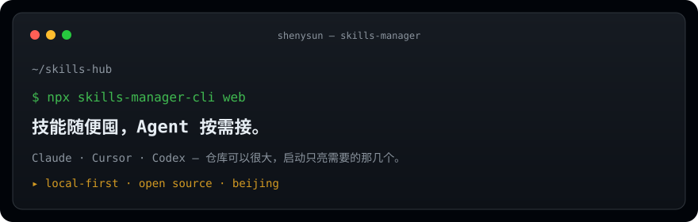

<p align="center">
  
</p>

<p align="center">
  <a href="https://github.com/shenysun/skills-manager">
    
  </a>
</p>

<p align="center">
  <a href="https://github.com/shenysun/skills-manager"></a>
  <a href="https://github.com/shenysun/skills-manager"></a>
  
</p>

---

### 现在在做

**[skills-manager](https://github.com/shenysun/skills-manager)** — 本地优先的 Agent 技能仓库。  
技能收进一份 hub，再按需接入 Claude / Cursor / Codex。不是一股脑塞进运行时目录。

```sh
npx skills-manager-cli web
```

<p align="center">
  
  
</p>

以前做游戏客户端 / 工具链（Egret、Cocos、Electron）。现在在做 Agent 技能的收纳和分发。
